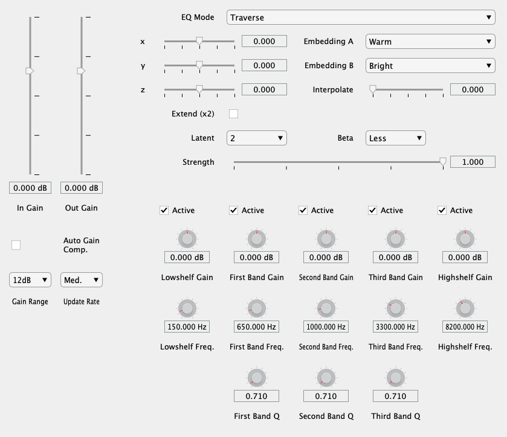
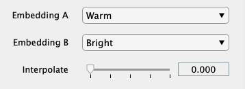
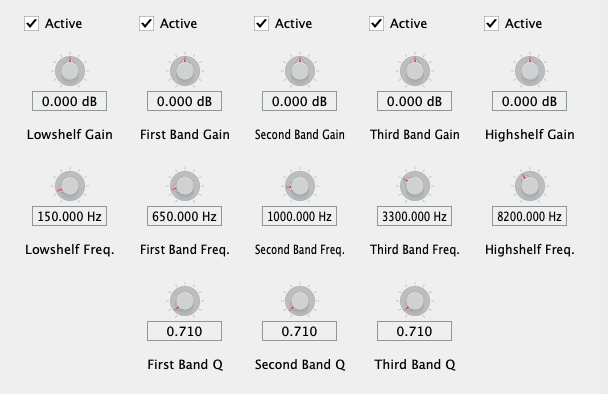

# 

flowEQ presents a new way to navigate equalization in the music production process.


## Table of contents

- [Overview](#overview)
- [Setup](#setup)
    - [MATLAB](#matlab)
    - [Training](#training)
- [Controls](#controls)
- [Visualizer](#visualizer)
- [Theory](#theory)
    - [VAE](#vae)
	- [Training](#training)
    - [Evaluation](#evaluation)
- [Resources](#resources)
- [License](#license)

## Overview


## Setup

Pre-compiled binaries are available on my [website](https://christiansteinmetz.com). Just download the one for your platform and add it to the system directory designed for audio plugins.
Restarting your DAW or forcing it to re-scan the audio plugin directories should make it appear. 

```
Windows
VST3: ​C:\Program Files\Common Files\VST3

macOS
AU: ​Macintosh HD/Library/Audio/Plug-Ins/Components
VST3: ​Macintosh HD/Library/Audio/Plug-Ins/VST3
```

Read on if you are interested in running the plugin as MATLAB code, compiling it yourself, or modifying the models. 

### MATLAB

To run the plugin as MATLAB code or compile the plugin for your platform you will need to have MATLAB 2019b along with the [Audio Toolbox](https://www.mathworks.com/products/audio.html).
You can use an older version of MATLAB (not later than 2018a), but this will not include support for the customized GUI. 

Start by cloning this repository.

```
git clone https://github.com/csteinmetz1/flowEQ.git
```

Once you have cloned the repository, you will first need to either download the trained models or train them yourself.

The easiest method is to download all of the assets needed to compile the plugin directly. 
Simply download the latest archive from [here](https://drive.google.com/drive/folders/1xelm4m3y0iqAs_GObi_Leq7Q-rVdlP-d?usp=sharing).
Extract this archive into a new directory `plugin/assets/`.

To compile the plugin simply open MATLAB and navigate to the `plugin/` directory. 
Run the `build.m` function from the Command Window and the process will start.

```
>> build
```

The build process takes about 60 seconds on my 2018 MacBook Pro.
This will produce the compiled plugin in the same directory as an AudioUnit (AU) if you are on MacOS (`flowEQ.component`).
On Windows, this will create a VST plugin (`flowEQ.vst`). 
Running the plugin as MATLAB code is just as easy. 

```
>> run
```
If you are interested in training the models on your own see the steps below.

### Training

There are a number of steps to train the models.
A shell script, `init.sh`, located in the `train/` directory will carry out of all this setup and training for you (macOS or Linux).
Optionally, you can follow along with the steps outlined below.

To train the models, you will first need to get the [SAFE-DB dataset](http://www.semanticaudio.co.uk/datasets/data/) (only about 4 MB).
In this case, we only need the User Data (`SAFEEqualiserUserData.csv`) from the parametric equalizer. 
Place this csv file in a new directory at the top level of project called `data/safe`. 

Before using any of the Python scripts you need to install the dependencies.
I recommend using a [virtual environment](https://docs.python-guide.org/dev/virtualenvs/) or similar.

```
pip install -r requirements.txt
```

Next we need to preprocess the dataset using `train/preprocess.py`. 

This script performs a number of important tasks:

- Add proper names to each column of the dataframe
- Create transfer function plots for each sample in the dataset
- Normalize each parameter value to lie between 0 and 1
- Create a new csv file with the descriptors ranked by their frequency
- Sort the three middle bands by their center frequencies (in ascending order)
- Shuffle the samples before training 
- Save all the modified data to a new file `normalized_eq_params.csv`

We are now ready to train some models. 💫

The main training script, `trainall.py` will load the data and then train 12 separate models.
Each model has different hyperparameter settings and the user will be able to select these different models from within the plugin.
You can read more about this in the [Theory](#theory) section.

| Model  | 1     | 2     | 3     | 4     | 5     | 6     | 7     | 8     | 9     | 10    | 11    | 12    |
| ------ | ----- | ----- | ----- | ----- | ----- | ----- | ----- | ----- | ----- | ----- | ----- | ----- |
| Latent | 1D    | 1D    | 1D    | 1D    | 2D    | 2D    | 2D    | 2D    | 3D    | 3D    | 3D    | 3D    |
| β      | 0.000 | 0.001 | 0.01  | 0.02  | 0.000 | 0.001 | 0.01  | 0.02  | 0.000 | 0.001 | 0.01  | 0.02  | 

After training has finished (this will probably take about an hour or so running on CPU), a new directory will be created in `models/`.
This contains saved model architectures and weights for each of the 12 models, with separate models separated as the autoencoder, decoder, and encoder.
Another directory contains plots of the data manifold as well as a scatter plot of the dataset projected into each latent space.

With all of the models trained, the final step is to generate latent codes (embeddings) of the *warm* and *bright* descriptors for each model.
Simply run the `embeddings.py` script with the path to the models directory generated during training.

```
python embeddings.py ../models/20190714-153626/
```

This will create a new file, `assets/codes.mat`, that contains an array of all the embeddings that will be loaded by the plugin. 
We are now ready to build the plugin. 
The build script will complete one final step which is to convert the hdf5 models generated by the training script using Keras to mat files that can be loaded by the plugin.
Just pass the directory of the models 

```
>> build('../models/20190714-153626')
```

We made it. 🎉 You now have a VST or AU plugin ready to be loaded in DAW. 

## Controls

The EQ features three modes of operation, which are selected using the **EQ Mode** control at the top of the plugin.



### Traverse


The *Traverse* mode allows the user to freely investigate the latent space of the three separate models.
In this mode the three **x**, **y**, **z** sliders can be used to traverse the latent space of the decoder.
Each latent vector decodes to a set of values for the thirteen parameters in the five band equalizer. 
By enabling the **Extend** mode, the limits of the sliders is extended by a factor of 2. 
This means that a slider value of *-2* will be decoded as *-4* and so forth.
This allows for more of the latent space to be explored but may produce more strange and undesirable results.


### Semantic 



This mode allows for a more controlled interface for sampling from the latent space. 
The **x**, **y**, **z** sliders are deactivated, and the **Embedding A** and **Embedding B** comboboxes are used, along with the **Interpolate** slider. 
After training, the semantic labels are used to identify relevant clusters within the latent space. 
These clusters represent areas of the latent space which are associated with certain semantic descriptors. 
The **Interpolate** control allows users to seamlessly move between the two semantic descriptors in the latent space.
By default the value is set to *0*, which means that the decoder is using the latent vector specified by **Embedding A**.
As the use increases this value to *1*, a new latent vector is calculated, which lies somewhere between A and B. 
When set to *1*, the latent vector of B will be used as input to the decoder. 

### Manual



Manual mode provides the user with direct control of the five band parametric equalizer using the controls at the bottom of the plugin.
Unfortunately, the framework does not currently provide a means to link the parameters of the manual equalizer with the decoder equalizer. 
In a future implementation (via JUCE), the user will be able to seamlessly switch between interacting with the decoder and see those parameters
updated in real-time on the full manual parametric equalizer below. 
This will enable users to quickly search the latent space with the decoder for a relevant timbre and then tweak it further with the manual controls.

### Additional controls


#### Latent

The **Latent** control allows the user to switch between models with different a different number of latent dimensions (1, 2, or 3).
For example, with the default setting of *2*, only the **x** and **y** values will be used. 

#### Strength

This control allows the user to decrease the intensity of strength of the equalizer by simply scaling the gains for each band. 
A **Strength** setting of *1* will result in the equalizer applied with the exact gains for each band as produced by the decoder.
Lower this value will scale the gain values downward, making the equalizer's effect less prominent. 
A setting of *0* will have the effect of turning all gains to *0* and therefore bypassing the equalizer all together. 

#### β (disentanglement)

#### Automatic gain compenstation


#### In/Out gain


These are very straightforward controls that allow the user to adjust the level of the audio both before it enters the equalizer and after it is equalized.
These controls prove useful when additional headroom is needed or to change the output level to match another source for comparison. 
Both sliders are active in all modes of operation.

## Visualizer 

## Theory

### VAE
### Training
### Evaluation

## Resources
## License