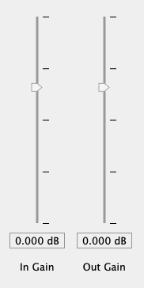

# 

flowEQ presents a new way to navigate equalization in the music production process.


## Overview

**flowEQ** uses a disentangled variational autoencoder (β-VAE) in order to provide a new modality for modifying the timbre of recordings via a parametric equalizer. 
By using the trained decoder network, the user can more quickly search through the configurations of a five band parametric equalizer.
This methodology promotes using one's ears to determine the proper EQ settings instead of looking at transfer functions or specific frequency controls.
Two main modes of operation are provided (**Traverse** and **Semantic**), which allow users to sample from the latent space of the 12 train models.

Download the VST/AU plugin from [https://csteinmetz1.github.io/flowEQ/](https://csteinmetz1.github.io/flowEQ/)

### Applications

- Quick and easy timbral adjustments
- Automated timbral shifts over time for creative effects
- Powerful 'tone controls' for users in a playback/listening setting


> VST plugin with custom GUI shown running in REAPER

## Table of contents

- [Overview](#overview)
- [Setup](#setup)
    - [MATLAB](#matlab)
    - [Training](#training)
- [Controls](#controls)
    - [Traverse](#traverse)
    - [Semantic](#semantic)
    - [Manual](#manual)
    - [Additional](#additional-controls)
- [Visualizer](#visualizer)
- [Resources](#resources)
- [License](#license)

## Setup

Pre-compiled binaries are available on the [project website](http://flowEQ.ml). Just download the one for your platform and add it to the system directory designed for audio plugins.
Restarting your DAW or forcing it to re-scan the audio plugin directories should make it appear. 

```
Windows
VST3: ​C:\Program Files\Common Files\VST3

macOS
AU: ​Macintosh HD/Library/Audio/Plug-Ins/Components
VST3: ​Macintosh HD/Library/Audio/Plug-Ins/VST3
```

Skip over to the [Controls](#controls) section to learn how to use the plugin.
Read on if you are interested in running the plugin as MATLAB code, compiling it yourself, or modifying the models. 

### MATLAB

To run the plugin as MATLAB code or compile the plugin for your platform you will need to have MATLAB 2019b along with the [Audio Toolbox](https://www.mathworks.com/products/audio.html).
You can use an older version of MATLAB, but this will not include support for the customized GUI. 

Start by cloning this repository.

```
git clone https://github.com/csteinmetz1/flowEQ.git
```

Once you have cloned the repository, you will first need to either download the trained models or train them yourself.
The easiest method is to download all of the assets needed to compile the plugin directly (pre-trained, converted models and latent codes). 
Simply download the latest archive from [here](https://drive.google.com/drive/folders/1xelm4m3y0iqAs_GObi_Leq7Q-rVdlP-d?usp=sharing).
Extract this archive into a new directory `plugin/assets/`.

To compile the plugin, simply open MATLAB and navigate to the `plugin/` directory. 
Run the `buildPlugin.m` function from the Command Window and the process will start.
This will produce compiled plugins for flowEQ and flowEQ-lite in the same directory. 

```MATLAB
>> buildPlugin
```

Running the plugin as MATLAB code is just as easy. 

```MATLAB
>> runPlugin            % for full plugin
>> runPlugin('lite')    % for lite version 
```

If you are interested in training the models on your own, see the steps below.

#### Notes for Windows

The process for compiling the plugin on Windows is similar but requires a few more details.
You will need the Visual Studio 2017 C++ compiler which you can get via [Visual Studio Community 2017](https://visualstudio.microsoft.com/vs/older-downloads/).
Make sure to select the C++ build tools during the installation as well as the Windows SDK.

In MATLAB you will need to configure the C++ compiler, which you can do by running the `mex -setup c++` command.
If successful you should see a note that mentions MATLAB is configured to use the Visual Studio 2017 C++ compiler.
Note that you CANNOT use the [mingw-w64 compiler](http://mingw-w64.org/doku.php) that MATLAB recommends for other use cases.

### Training

There are a number of steps to train the models.
A shell script, `init.sh`, located in the `train/` directory will carry out of all this setup and training for you (macOS or Linux).
Optionally, you can follow along with the steps outlined below.

To train the models, you will first need to get the [SAFE-DB dataset](http://www.semanticaudio.co.uk/datasets/data/) (only about 4 MB).
In this case, we only need the User Data (`SAFEEqualiserUserData.csv`) from the parametric equalizer. 
Place this csv file in a new directory at the top level of project called `data/safe`. 

Before using any of the Python scripts you need to install the dependencies.
I recommend using a [virtual environment](https://docs.python-guide.org/dev/virtualenvs/) or similar.

```
pip install -r requirements.txt
```

Next we need to preprocess the dataset using `train/preprocess.py`. 

This script performs a number of important tasks:

- Add proper names to each column of the dataframe
- Create transfer function plots for each sample in the dataset
- Normalize each parameter value to lie between 0 and 1
- Create a new csv file with the descriptors ranked by their frequency
- Sort the three middle bands by their center frequencies (in ascending order)
- Shuffle the samples before training 
- Save all the modified data to a new file (`normalized_eq_params.csv`)

We are now ready to train some models. 💫

The main training script, `trainall.py` will load the data and then train 12 separate models.
Each model has different hyperparameter settings and the user will be able to select these different models from within the plugin.
You can read more about this in the [Theory](#theory) section.

| Model  | 1     | 2     | 3     | 4     | 5     | 6     | 7     | 8     | 9     | 10    | 11    | 12    |
| ------ | ----- | ----- | ----- | ----- | ----- | ----- | ----- | ----- | ----- | ----- | ----- | ----- |
| Latent | 1D    | 1D    | 1D    | 1D    | 2D    | 2D    | 2D    | 2D    | 3D    | 3D    | 3D    | 3D    |
| β      | 0.000 | 0.001 | 0.01  | 0.02  | 0.000 | 0.001 | 0.01  | 0.02  | 0.000 | 0.001 | 0.01  | 0.02  | 

After training has finished (this will probably take about an hour or so running on CPU), a new directory will be created in `models/`.
This contains saved model architectures and weights for each of the 12 models, with separate models separated as the autoencoder, decoder, and encoder.
Another directory contains plots of the data manifold as well as a scatter plot of the dataset projected into each latent space.

With all of the models trained, the final step is to generate latent codes (embeddings) of the *warm* and *bright* descriptors for each model.
Simply run the `embeddings.py` script with the path to the models directory generated during training.

```
python embeddings.py ../models/20190714-153626/
```

This will create a new file, `assets/codes.mat`, that contains an array of all the embeddings to be loaded by the plugin. 
We are now ready to build the plugin. 
The build script will complete one final step, which is to convert the hdf5 models generated by the training script using Keras to mat files that can be loaded by the plugin.
Just pass the directory of the models as below (Your directory will contain a different date code).

```
>> build('../models/20190714-153626')
```

We made it 🎉 You now have a VST or AU plugin ready to be loaded in your DAW. 

## Controls

The EQ features three modes of operation, which are selected using the **EQ Mode** control at the top of the plugin.

### Traverse


The *Traverse* mode allows the user to freely investigate the latent space of the models.
In this mode the three **x**, **y**, **z** sliders can be used to traverse the latent space of the decoder.
Each latent vector decodes to a set of values for the thirteen parameters in the five band equalizer. 
By enabling the **Extend** mode, the limits of the sliders is extended by a factor of 2. 
This means that a slider value of *-2* will be decoded as *-4*, and so forth.
This allows for more of the latent space to be explored but may produce more strange and undesirable results.

The **Latent** control determines which sliders are active in this mode:

| Latent | Active sliders |
| ------ | -------------- |
| 1      | x              |
| 2      | x, y           | 
| 3      | x, y, z        |

### Semantic 


This mode allows for a different method of sampling from the latent space. 
The **x**, **y**, **z** sliders are deactivated, and the **Embedding A** and **Embedding B** comboboxes are used, along with the **Interpolate** slider. 

After training, the semantic labels are used to identify relevant clusters within the latent space. 
These clusters represent areas of the latent space which are associated with certain semantic descriptors. 
The **Interpolate** control allows users to seamlessly move between the two semantic descriptors in the latent space.
By default the value is set to *0*, which means that the decoder is using the latent vector specified by **Embedding A**.
As the use increases this value to *1*, a new latent vector is calculated, which lies somewhere between A and B. 
When set to *1*, the latent vector of B will be used as input to the decoder. 

### Manual


Manual mode provides the user with direct control of the five band parametric equalizer using the controls at the bottom of the plugin.
Unfortunately, the framework does not currently provide a means to link the parameters of the manual equalizer with the intelligent equalizer. 

In a future implementation (via [JUCE](https://juce.com/)), the user will be able to seamlessly switch between interacting with the decoder and see those parameters
updated in real-time on the full manual parametric equalizer below. 
This will enable users to quickly search the latent space with the decoder for a relevant timbre and then tweak it further with the manual controls.

Each of the five bands features an **Active** checkbox. Un-checking one of these will deactivate the respective band. 
This is applicable both in *Manual* mode as well as *Traverse* and *Semantic*, although it may prove less useful in the later two.

### Additional controls


#### Latent

The **Latent** control allows the user to switch between models with different a different number of latent dimensions (1, 2, or 3).
For example, with the default setting of *2*, only the **x** and **y** values will be used. 
Increasing the latent dimension gives more control over the shape of the generated EQ curve but requires tuning more parameters. 
Decreasing the latent dimension makes searching through the latent space faster, but at the cost of find control. 

#### β (disentanglement)

This control (a.k.a disentanglement) allows the user to sample from models with varying levels of latent space disentanglement. 
Setting this to a lower value will decrease the regularization of the latent space.
This means that moving along a certain dimension is tied less to a specific feature of the equalizer curve, or more entangled.
Greater β means the dimensions of the latent space are more closely tied to a specific feature (in this case *warm* and *bright*).

It is recommended to leave this control at the default.
The intuition behind this control is outlined further in the [Theory](#theory) section.

#### Strength

This control allows the user to decrease the intensity, or strength, of the equalizer by simply scaling the gains for each band. 
A **Strength** setting of *1* will result in the equalizer applied with the exact gains for each band as produced by the decoder.
Lowering this value will scale the gain values downward (toward 0dB), making the equalizer's effect less prominent. 
A setting of *0* will have the effect of turning all gains to *0* and therefore bypassing the equalizer all together. 

#### Automatic gain compensation


Since it is difficult to examine differences in signals that are perceived at different levels, an automatic gain compensation feature is included.
When enabled, this control monitors the difference in the perceived loudness ([ITU-R BS.1770 Short-term loudness](https://www.mathworks.com/help/audio/ref/loudnessmeter-system-object.html)) between the input (unprocessed audio) and the output (post-EQ). 
A gain offset is then applied to force the output level to match the input. 
This makes comparing different equalizer settings easier.

The default settings work well, but the user can adjust the Update Rate, which will change how quickly the gain adjustment value is moved (if it is too fast clicks will be audible).
The Gain Range setting will limit the maximum amount of gain compensation applied in the positive or negative directions (12 dB allows for +12 dB or - 12 dB of adjustment).

Make sure to disable this control after setting the equalizer, or you may hear fluctuations in volume as audio is played.

#### In/Out gain



These are very straightforward controls that allow the user to adjust the level of the audio both before it enters the equalizer and after it is equalized.
These controls prove useful when additional headroom is needed or to change the output level to match another source for comparison. 
Both sliders are active in all modes of operation.

## Visualizer 

Since the MATLAB Audio Toolbox does not provide a means for more advanced visualizations within the GUI a second, small MATLAB program is provided to make visualizations in real-time.
This works by sending data from the plugin over UDP to the visualizer. This program features two windows.

### Equalizer transfer function


Using the [dsp.DynamicFilterVisualizer](https://www.mathworks.com/help/dsp/ref/dsp.dynamicfiltervisualizer.html), 
the current filter coefficients from **flowEQ** are displayed on a magnitude response plot. 
This helps to provide greater visual feedback to the user on the equalizer parameters, since they cannot be linked to the knobs within the plugin itself. 
Traversing the latent space and observing these transfer functions lends insight into the structure of the latent space for each trained model.

### Latent space embedding


This visualization shows the physical location of the current latent code within the N dimensional latent space of the current model. 
As shown in the animation above, when the user changes the **Latent** control in the plugin, the plot transitions from a 2D to a 2D plot. 
When using a one dimensional model, a 2D plot is shown but the code only moves across the x-axis.

### Usage

To run the visualizer open MATLAB, navigate to `plugin/` and start the script.

```
>> UDPVisualizer
```

Unfortunately, due to security provisions in the last few versions of macOS ([SIP](https://support.apple.com/en-us/HT204899)), 
the visualizer will not run correctly as a compiled plugin. 
To use the visualizer you can run two instances of MATLAB, one in which the plugin is run as MATLAB code, and the other which runs the visualizer.
The visualizer should work on Windows as a VST, but this has yet to be tested.

## Trained models


> 2D manifold during training over 200 epochs (β = 0.010)


> Training data projected into 2D latent space over 200 epochs (β = 0.010)

## Resources

> R. Stables, S. Enderby, B. De Man, G. Fazekas, and J. D. Reiss, “SAFE: A system for the extraction and retrieval of semantic audio descriptors”, The International Society for Music Information Retrieval (ISMIR), 2014.

> Bowman, S. R., Vilnis, L., Vinyals, O., Dai, A. M., Jozefowicz, R., & Bengio, S. "Generating sentences from a continuous space." arXiv preprint arXiv:1511.06349. 2015.

> R. Stables, B. De Man, S. Enderby, J. D. Reiss, G. Fazekas, and T, Wilmering, "Semantic description of timbral transformations in music production." Proceedings of the 24th ACM international conference on Multimedia. ACM, 2016.

> S. Stasis, R. Stables, and J. Hockman, "Semantically controlled adaptive equalisation in reduced dimensionality parameter space". Applied Sciences, 6(4), 116. 2016.

> Higgins, Irina, et al. "β-VAE: Learning Basic Visual Concepts with a Constrained Variational Framework." ICLR 2.5 (2017): 6.

> C. P. Burgess, I. Higgins, A. Pal, L. Matthey, N. Watters, G. Desjardins, and A. Lerchner, "Understanding disentangling in β-VAE." arXiv preprint arXiv:1804.03599. 2018.

## License
This project is licensed under the BSD license, as specified by the [MATLAB Central Terms of Use](https://www.mathworks.com/matlabcentral/termsofuse.html#filex) 
and the [MATLAB Central File Exchange Licensing FAQ](https://www.mathworks.com/matlabcentral/FX_transition_faq.html#What_is_BSD).
The code is also jointly hosted on [MATLAB Central File Exchange for download](), as required by the [AES MATLAB Plugin Student Competition](http://www.aes.org/students/awards/mpsc/).
The full text of the BSD license is available on the [Open Source Initiative site](https://opensource.org/licenses/BSD-3-Clause).
