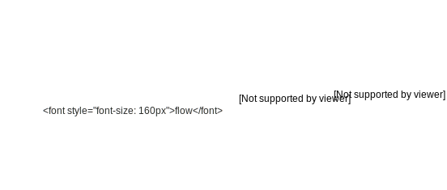

# 

flowEQ presents a new way to navigate equalization in the music production process.


## Table of contents

- [Overview](#overview)
- [Setup](#setup)
    - [VST](#vst)
    - [MATLAB](#matlab)
- [Controls](#controls)
- [Visualizer](#visualizer)
- [Theory](#theory)
    - [VAE](#vae)
	- [Training](#training)
    - [Evaluation](#evaluation)
- [Resources](#resources)
- [License](#license)

## Overview


## Setup

There are two options to install the plugin. 
You can either install the VST/AU plugin compiled for your platform or use MATLAB (along with the [Audio Toolbox](https://www.mathworks.com/products/audio.html))
to compile the plugin yourself for your platform. 

### Binaries

Pre-compiled binaries are available on my [website](https://christiansteinmetz.com). Just download the one for your platform and add it to the system directory designed for audio plugins.
Restarting your DAW or forcing it to re-scan the audio plugin directories should make it appear. 

### MATLAB

To run the plugin as MATLAB code or compile the plugin for your platform you will need to have MATLAB 2019b along with the [Audio Toolbox](https://www.mathworks.com/products/audio.html).
Using an older version of MATLAB (not later than 2018a), but this will not include support for the customized GUI. 

Start by cloning this repository.

```
git clone https://github.com/csteinmetz1/flowEQ.git
```

To compile the plugin simply open MATLAB and navigate to the `plugin/` directory. 
Run the `build.m` function from the Command Window and the process will start.
The build process takes about 60 seconds on my 2018 MacBook Pro.
This will produce the compiled plugin in the same directory as an AudioUnit (AU) if you are on MacOS (`flowEQ.component`).
On Windows, this will create a VST plugin (`flowEQ.vst`). 

## Controls

The EQ features three modes of operation, which are selected using the **EQ Mode** control at the top of the plugin.

### Traverse

The *Traverse* mode allows the user to freely investigate the latent space of the three separate models.
In this mode the three **x**, **y**, **z** sliders can be used to traverse the latent space of the decoder.
Each latent vector decodes to a set of values for the thirteen parameters in the five band equalizer. 
By enabling the **Extend** mode, the limits of the sliders is extended by a factor of 2. 
This means that a slider value of *-2* will be decoded as *-4* and so forth.
This allows for more of the latent space to be explored but may produce more strange and undesirable results.

### Semantic 

This mode allows for a more controlled interface for sampling from the latent space. 
The **x**, **y**, **z** sliders are deactivated, and the **Embedding A** and **Embedding B** comboboxes are used, along with the **Interpolate** slider. 
After training, the semantic labels are used to identify relevant clusters within the latent space. 
These clusters represent areas of the latent space which are associated with certain semantic descriptors. 
The **Interpolate** control allows users to seamlessly move between the two semantic descriptors in the latent space.
By default the value is set to *0*, which means that the decoder is using the latent vector specified by **Embedding A**.
As the use increases this value to *1*, a new latent vector is calculated, which lies somewhere between A and B. 
When set to *1*, the latent vector of B will be used as input to the decoder. 

### Manual

Manual mode provides the user with direct control of the five band parametric equalizer using the controls at the bottom of the plugin.
Unfortunately, the framework does not currently provide a means to link the parameters of the manual equalizer with the decoder equalizer. 
In a future implementation (via JUCE), the user will be able to seamlessly switch between interacting with the decoder and see those parameters
updated in real-time on the full manual parametric equalizer below. 
This will enable users to quickly search the latent space with the decoder for a relevant timbre and then tweak it further with the manual controls.

There are also a few additional controls that allow users to more accurately tune the generate equalizer parameters.

### Latent

The **Latent** control allows the user to switch between models with different a different number of latent dimensions (1, 2, or 3).
For example, with the default setting of *2*, only the **x** and **y** values will be used. 

### Strength

This control allows the user to decrease the intensity of strength of the equalizer by simply scaling the gains for each band. 
A **Strength** setting of *1* will result in the equalizer applied with the exact gains for each band as produced by the decoder.
Lower this value will scale the gain values downward, making the equalizer's effect less prominent. 
A setting of *0* will have the effect of turning all gains to *0* and therefore bypassing the equalizer all together. 

### Input/Output gain

These are very straightforward controls that allow the user to adjust the level of the audio both before it enters the equalizer and after it is equalized.
These controls prove useful when additional headroom is needed or to change the output level to match another source for comparison. 
Both sliders are active in all modes of operation.

## Visualizer 

## Theory

### VAE
### Training
### Evaluation

## Resources
## License